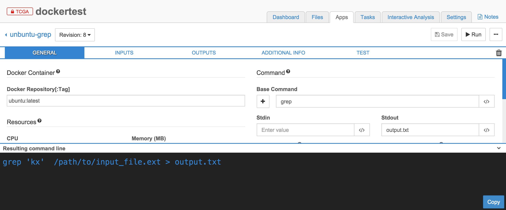
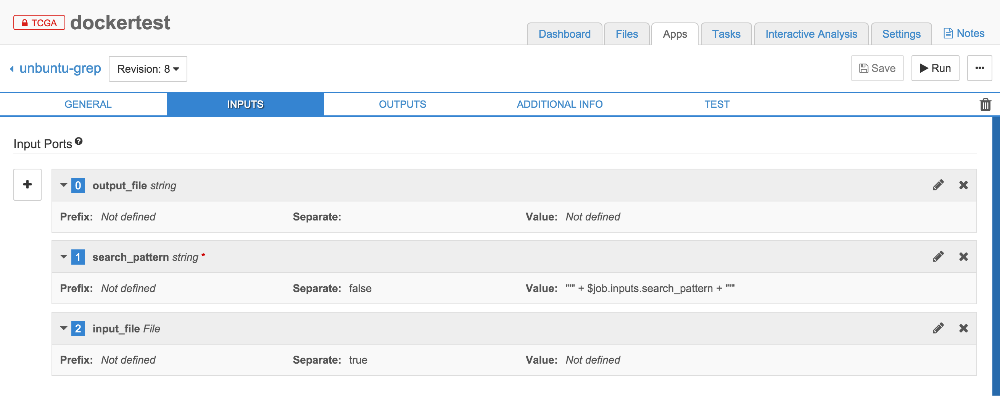
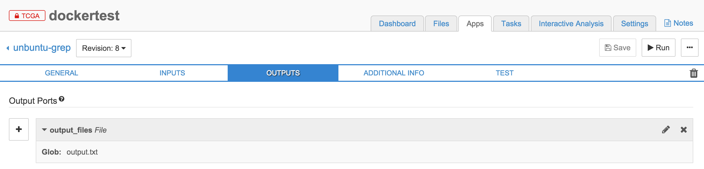
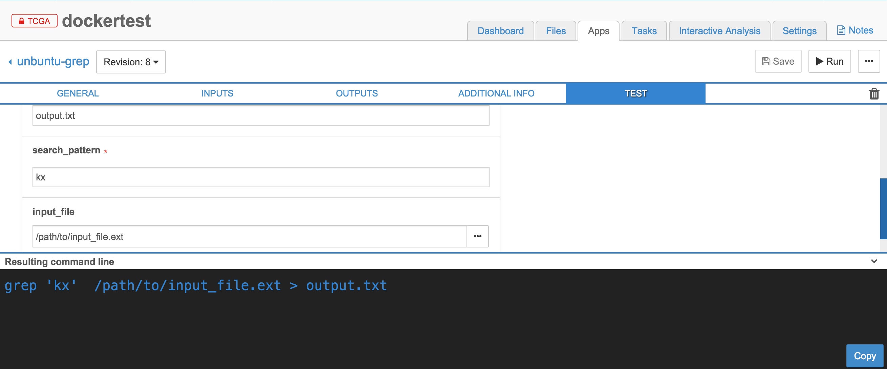
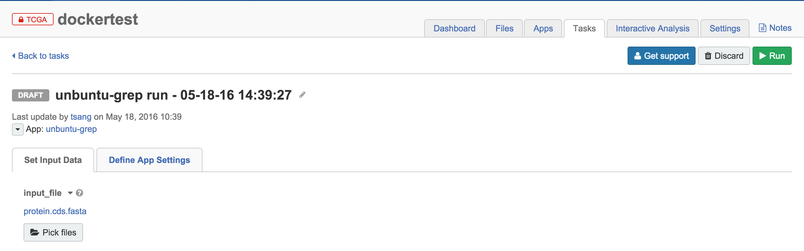
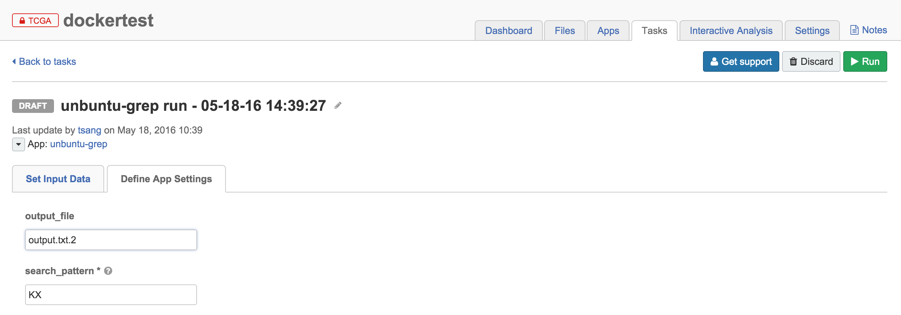
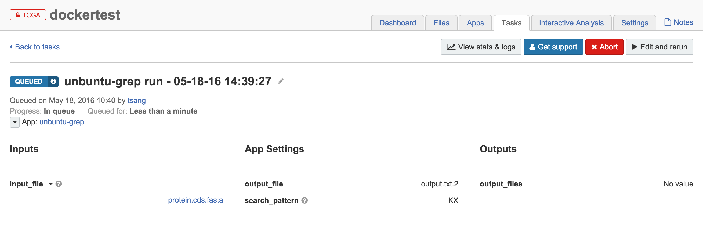
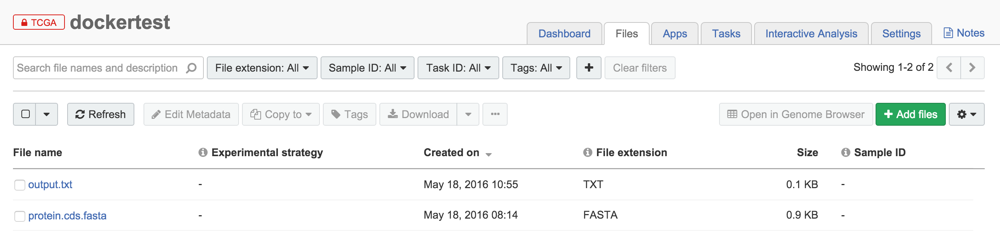

This workflow decribes the installation of Docker and run a tool using a Docker image in the SBG CGC image registry.

1) Install Docker  
2) Pull the Hello-world image from Docker and confirm installation  
3) Create a tool in SBG-CGC using a Docker image and SBG User Interface  

References:  
<http://docs.cancergenomicscloud.org/docs/upload-your-docker-image>  
<https://docs.docker.com/engine/userguide/containers/dockerimages/>

To start, make sure you have an account with Seven Bridges CGC.  

```{r setup, include=FALSE}
knitr::opts_chunk$set(echo = TRUE)
```

### Install Docker
<https://docs.docker.com/engine/installation/>  
There are many ways of installing Docker.  Go to the url above for installation details.  

I installed Docker using "Homebrew" on my mac.    

````{}
brew install docker
brew install docker-machine
````
### Using Docker with SB CGC
####Run docker

-list docker machines  
-start the machine called "dev"  
-generate certificate so docker machine can talk to "dev"  
-tell docker to talk to "dev" with the certificate  
-connect shells to the machine "dev"  

```{}
docker-machine ls

#if you do not have host named "dev"
docker-machine create --driver virtualbox dev
#if you have a host named "dev
docker-machine start dev

docker-machine regenerate-certs dev
docker-machine env dev
eval "$(docker-machine env dev)"
```

To stop/remove the host called "dev" - skip this for now  
````{eval=FALSE}
docker-machine stop dev
docker-machine rm dev
````

### The Hello-world example 
To check your installation, pull and run the hello-world image from the docker respository.   
You should see a "Hello from Docker" message, which confirms that docker is installed correctly.  

````{}
docker pull hello-world
docker images
docker run hello-world
`````

### A simple example creating a tool in Ubuntu using the CGC image registry  
This tutorial assumes that you are familiar with the basics of Seven Bridges CGC.  
If not, please check out <http://teamcgc.nci.nih.gov.s3-website-us-east-1.amazonaws.com/>  


In this example, we will use the unix command "grep" to look for a string ("KX") in a input FASTA file and print the line containing that string in an output file  

Input FASTA file content  
````{}
>gb:KU991811|Organism:Zika virus Brazil/2016/INMI1-Asian|Segment:null|Subtype:Asian|Host:Human
MKNPKKKSGGFRIVNMLKRGVARVSPFGGLKRLPAGLLLGHGPI

>gb:KU955590|Organism:Zika virus Z16019-Asian|Segment:null|Subtype:Asian|Host:Human
MKNPKKKSGGFRIVNMLKRGVARVSPFGGLKRLPAGLLLGHGPI

>gb:KU922960|Organism:Zika virus MEX/InDRE/Sm/2016-Asian|Segment:null|Subtype:Asian|Host:Human
MKNPKKKSGGFRIVNMLKRGVARVSPFGGLKRLPAGLLLGHGPI

>gb:KX056898|Organism:Zika virus Zika virus/GZ02/2016-Asian|Segment:null|Subtype:Asian|Host:Human
MKNPKKKSGGFRIVNMLKRGVARVSPFGGLKRLPAGLLLGHGPI

>gb:KU922923|Organism:Zika virus MEX/InDRE/Lm/2016-Asian|Segment:null|Subtype:Asian|Host:Human
MKNPKKKSGGFRIVNMLKRGVARVSPFGGLKRLPAGLLLGHGPI

>gb:KU963574|Organism:Zika virus ZIKV/Homo sapiens/NGA/IbH-30656_SM21V1-V3/1968-West_African|Segment:null|Subtype:West_African|Host:Human
MKNPKKKSGGFRIVNMLKRGVARVNPLGGLKRLPAGLLLGHGPI
````
<br />
<br />
<br />
We will create a tool with the latest Ubuntu image in the CGC registry to search the above input file for a sequence header containing the string "KX"   
<br />
<br />
<br />

Under "GENERAL"
- Login to your CGC account  
- Click on the "Apps" tab  
- Click on "+Add app"  
- Click on "Create Tool"  
- Enter a name for the tool "ubuntu-grep", Click "Create"  
- Enter "ubuntu:latest" in the Docker Repository field  
- Enter "grep" in the Base Command field  
- Enter "output.txt"  
This creates a tool that will pull the latest Ubuntu image from the CGC register, run the "grep" command and create an output file named "output.txt"   
<br />
<br />
<br />

Under "INPUTS"
- Create 3 input ports by clicking on the "+" sign.
You want the resulting command line to look like -    
"grep 'string_pattern' input_file > output.txt"  
grep (base command) is position 0 in the command line  
'string pattern' is position 1 in the command line  
input_file is position 2 in the command line   
<br />
<br />
<br />

Under "OUTPUTS"
- Create an output port by clicking on "+"  
<br />
<br />
<br />

Under "TEST"
You can enter different names different ports and see if the resulting command line looks right
- Click on "SAVE"
- Click on "RUN" to start a task with this tool
<br />
<br />
<br />

Under "Set Input Data"
- Click on "Pick files" to select the input file  
<br />
<br />
<br />

Under "Define App Settings"
- Enter the name of the output file and the string/pattern you want to search in the input file
- Click "Run" and confirm
<br />
<br />
<br />

Task being queued and waiting to run
<br />
<br />
<br />

<br />
You should see the output file under "Files"
In the output file (output.txt), you should see the header line containing the string "KX"

````{}
>gb:KX056898|Organism:Zika virus Zika virus/GZ02/2016-Asian|Segment:null|Subtype:Asian|Host:Human
````

